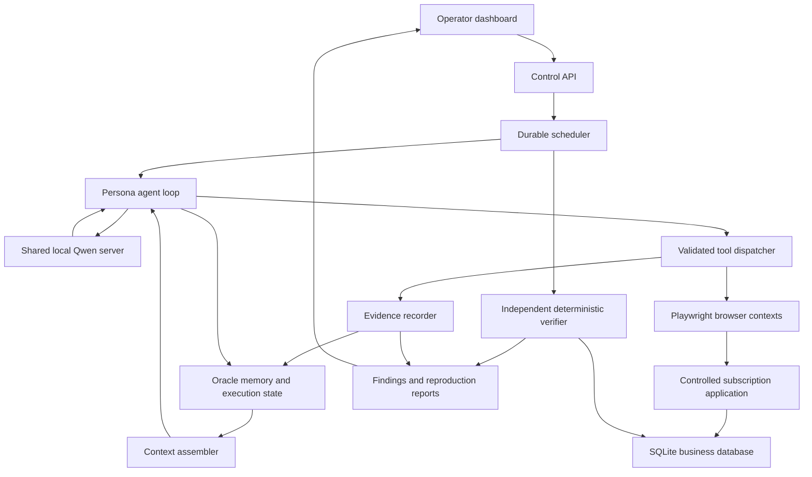

# Architecture

## Purpose and boundaries

The product tests a web application over repeated sessions. Each persona has a goal, account, preferences, previous actions, and unresolved expectations. A scheduler wakes personas, an agent chooses actions, a browser executes them, and independent checks establish whether the application behaved correctly.

The initial product is a local demonstration and reproducible evaluation system, not unrestricted testing of arbitrary websites. Test only the bundled application initially. A persona is a separate stateful session, not a separate model process.

Success means discovering seeded bugs with reproducible evidence while avoiding false reports on the corresponding fixed version. Memory's contribution must be measured, not assumed.

## Chosen implementation

| Component | Initial choice | Reason |
|---|---|---|
| Backend and agent runtime | Python 3.11+, FastAPI, Pydantic 2 | Typed contracts and one primary language |
| Local inference | Ollama adapter, configurable Qwen3-8B tag | One shared local model with no paid API requirement |
| Browser | Playwright Chromium | Controlled browser contexts and reproducible actions |
| Durable platform and memory database | Oracle through python-oracledb | Reuses the memory-aware agent architecture |
| Embeddings | Local sentence-transformers/all-MiniLM-L6-v2, 384 dimensions, CPU initially | No external embedding API and preserves GPU capacity |
| Demo business database | SQLite | Independent, resettable business state |
| Demo UI and operator UI | FastAPI templates, plain JavaScript, CSS | Keeps frontend complexity manageable for a solo build |
| Live events | Server-sent events | One-way updates are sufficient initially |
| Evidence artifacts | Local filesystem, metadata and hashes in Oracle | Keeps screenshots and traces out of model context |
| Tests | pytest, Playwright integration tests | Deterministic checks plus full scenario runs |

These are proposed defaults. Confirm package compatibility during foundation work and lock versions. Oracle deployment and credentials must be provided locally. Require an Oracle installation supporting the intended VECTOR operations for semantic search; a relational-only retrieval mode remains available when vector support is absent. Neither mode should silently claim vector retrieval is running.

## System map



## What happens during one session

1. Operator selects a scenario, fault configuration, personas, and execution budgets.
2. The platform creates an isolated demo database and run record. An explicit simulated business clock makes days pass without waiting real days.
3. Scheduler leases one ready persona session. Initial inference concurrency is one; browser contexts may remain open independently.
4. Browser opens that persona's existing account/session and returns a compact page observation with accessible element identifiers.
5. Context assembler adds system instructions, persona goal, current page, pending expectations, a small recent history, and scoped relevant memories.
6. Qwen proposes one action using a structured response. It may instead request memory retrieval or finish the session.
7. Runtime checks the response schema, action availability, argument types, run scope, and limits. At most one repair generation is allowed for malformed output.
8. A registered tool performs the action. The platform stores observation, action, result, timestamps, and evidence references before choosing the next action.
9. Trusted scenario events create or update durable expectations. The model may suggest expectations, but those are marked untrusted until validated against the scenario specification.
10. On completion, pause, or budget exhaustion, the runtime records the session outcome and a bounded summary. It schedules any future session explicitly.
11. The verifier checks relevant business invariants independently. Model suspicion alone is never a confirmed finding.
12. A report links the invariant violation to browser steps, before/after state, and evidence. An optional model-written explanation cannot alter the verifier's verdict.

## Personas

Start with two, then extend to four:

* New customer: signs up, explores the service, returns during a trial, upgrades later.
* Power user: revisits billing and changes plans through supported controls.
* Administrator: invites members, changes roles, transfers workspace ownership.
* Interrupted user: leaves onboarding incomplete, revisits pages, retries after an uncertain response.

Every persona owns separate account identifiers, browser storage, memories, goals, and expectations. Shared application documentation is a distinct read-only scope. Persona isolation must be checked in retrieval code rather than trusted to prompts.

## Memory architecture

All seven original memory categories have a role, but vector search is not appropriate for every lookup.

| Memory | Stored information | Read time | Write time |
|---|---|---|---|
| Conversation | Recent user/agent observations and decisions | Deterministically each step, bounded recent window | After each completed decision/action |
| Semantic | Application rules, approved facts, supported workflow descriptions | Relevant scoped retrieval at session start or on demand | Documentation ingestion and validated corrections |
| Workflow | Successful navigation procedures and known recovery procedures | Similar goal retrieval | Only after a workflow is verified successful |
| Toolbox | Tool name, version, schema reference, description | Fixed small allowed set in MVP | At tool registry initialization/version changes |
| Entity | Persona account, workspace, plan, role, onboarding state | Exact identifiers first; relevant semantic recall optionally | After observed and validated state changes |
| Summary | Bounded session summaries with source event references | At future sessions and when context needs compression | Session end or context compaction |
| Tool log | Complete structured action attempts and outcomes | Recent results or exact evidence lookup | Each attempt, including failures |

Store summary text alongside original events; compression never deletes underlying evidence. Tool outputs are data, not trusted instructions. Store business expectations in their own structured table, not exclusively in summaries or embeddings.

Every memory has run scope, optional persona scope, source, confidence label, validity interval, status, and provenance links. Updated facts supersede earlier facts without destroying history. Example: plan=free remains historically valid before an observed upgrade and plan=pro becomes current afterward. Expired facts must not be injected as current state.

The agent can request a bounded search_memory action. Routine deterministic retrieval occurs at every decision step. Memory writes are performed by the runtime after events; Qwen's extracted candidates require schema and provenance validation. No agent can declare its own unsupported assertion to be a verified fact.

## Context and model budget

Use one shared model server and a configurable semaphore defaulting to one inference request. Do not load a model copy per persona. Start with a configured context budget around 8,192 tokens only if the actual model/runtime and hardware support it; benchmark before increasing concurrency.

Reserve space for output and possible reasoning tokens. Available input budget = configured model context minus output reserve minus safety margin. Include instructions, tool schemas, page observation, and all retrieved text in accounting. Use a backend token counter when available and a clearly labeled conservative estimate otherwise.

Keep system rules, current goal, pending structured expectations, and current page. Trim older history and lower-ranked memory first, then summarize with source references. Never silently drop approval constraints or expected dates. Limit page text and tool result sizes; save complete artifacts outside the prompt.

Routine action selection defaults to non-thinking mode where the adapter supports it. Thinking mode is optional, budgeted, and must be evaluated for latency and success. Store decisions and concise rationales, not private reasoning traces.

## Demo application and seeded bugs

The application is a fictional team subscription product. No payments, external emails, or real customer data are required.

| Scenario | Healthy behavior | Seeded fault | Authoritative check |
|---|---|---|---|
| Trial return | Access until trial_start + 7 days | Trial expires at day 5 | Entitlement compared with scenario clock and seven-day rule |
| Payment retry | One ledger charge for one purchase operation | Retry creates a second charge | Ledger entries grouped by the same purchase operation identifier |
| Ownership transfer | New owner gains owner powers; old owner loses owner-only powers | Former owner retains permission | Real protected endpoint invoked under both user identities |
| Interrupted onboarding | Resume preserves completed steps | Resume drops a previously completed required step | Persisted progress and accessible next action checked against scenario rules |

Fault flags are visible only to the scenario controller and benchmark label collector. The agent and verifier receive no fault labels. The verifier uses invariant specifications, not a test that merely reads the flag. A deterministic script can confirm that a fault exists, but benchmark discovery counts only when the agent actually reaches the violating state.

## Scheduling, persistence, and recovery

Keep run state, sessions, leases, steps, expectations, memories, and findings in Oracle. Suggested run states: CREATED, RUNNING, PAUSED, COMPLETED, FAILED, CANCELLED. Session states: READY, LEASED, RUNNING, WAITING, COMPLETED, FAILED.

Business clock and wall clock are separate. Only the controller advances business time between completed scenario phases. Agents cannot advance time. Model timeouts, lease expiration, and metrics always use wall clock.

Checkpoint after each action. A process restart reloads session state and browser storage where possible, then re-observes the page. Do not blindly retry a state-changing action with an unknown outcome; reconcile application state first. Use action identifiers and application idempotency keys when supported. Record uncertain outcomes explicitly.

## Verification and reports

Three finding stages: suspicion, confirmed, inconclusive. A model can create suspicion. A named deterministic invariant checker creates confirmed or inconclusive. A separate replay result records reproduced, not_reproduced, or not_attempted.

Reports contain expected behavior and its source, actual behavior, persona and scenario, simulated timeline, action sequence, verifier output, screenshots or traces, and replay status. Replaying happens against a fresh copy with the same initial conditions. Deduplicate findings using invariant identifier, affected entity, scenario, and relevant evidence fingerprint.

## Boundaries and observability

Allowlist the controlled application's origin. Browser tools use element IDs generated from current observations; stale observations require refresh. Keep the admin fixture API unavailable to persona tools. Verifier has read-only business inspection plus dedicated checks of real permission endpoints, and no ability to rewrite the verdict's underlying evidence.

Record model latency, token estimates, queue delay, invalid outputs, retries, action count, tool errors, retrieved memory IDs, context size, per-persona progress, findings, and replay results. Dashboard shows a timeline and evidence, not generated claims of success.

## Evaluation

Run matched tasks with memory enabled and disabled, holding model, budgets, initial state, and fault configuration constant. Keep authoritative scenario expectations available to the verifier in both arms; disable cross-session agent memory only in the ablation. Repeat trials because model outputs vary.

Report task completion, triggered fault detection, false positives on healthy builds, replay success, tool-call validity, latency, and total model tokens. Include results per scenario and failed/inconclusive runs. Demonstrate deletion/isolation and stale-memory tests separately. Persistent storage does not imply model training or guaranteed improvement.

## Implementation layout

```text
src/synthetic_lab/
  contracts/        shared data models and protocols
  config.py        validated local configuration
  storage/         Oracle execution state and memory repositories
  memory/          retrieval, extraction, provenance, context assembly
  llm/             model adapter, validation, admission control
  browser/         Playwright sessions, observations, tool registry
  runtime/         agent loop, scheduler, checkpoints
  scenarios/       fixtures, clock phases, persona goals
  verification/    invariant checks and replay
  reporting/       evidence manifests and reports
  api/             control API and event stream
  dashboard/       operator templates and static assets
  demo/            controlled app, SQLite state, templates
tests/             unit, integration, scenario, and evaluation fixtures
scripts/           setup, local launch, evaluation
docs/              operational and benchmark documentation
```

## Delivery gates

Gate 1: demo app and two faults can be exercised manually; contracts, provider stub, and storage repositories are tested.

Gate 2: one persona completes a browser session with local Qwen, validated actions, logs, and strict budgets.

Gate 3: persona resumes after simulated days and process restart; retrieved memories have correct scope and provenance.

Gate 4: two initial bugs are discovered and independently confirmed, with healthy controls and reproducible reports.

Gate 5: four personas, all four scenarios, dashboard, matched memory evaluation, and clean-machine setup instructions.

Do not add distributed workers, Kubernetes, vector-based tool selection, fine-tuning, autonomous source-code fixes, or real payments to the initial scope.
